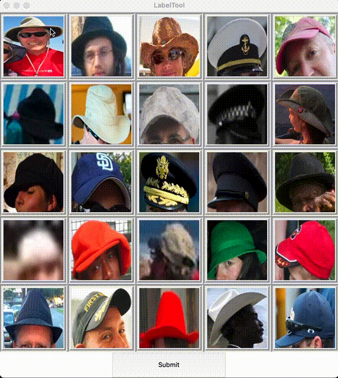

# LabelTool

Comfortable instrument for labeling and cleaning your image dataset.



## Installation

After cloning repo and installing all python dependencies move your images into `images` folder and run `main.py` script.

```sh
python main.py
```

## Usage example

If you're struggling with image labeling during data preparation this tool would be useful. 
Especialy if you're dealing with [imbalanced dataset][imbalanced_dataset]. This instrument can save you a lot of time and you can
configure it on `config.py` file.


## Meta

l3LlFF – [l3LlFF](https://www.kaggle.com/l3llff) – l3LlFF@protonmail.com

## Contributing

1. Fork it (<https://github.com/yourname/yourproject/fork>)
2. Create your feature branch (`git checkout -b feature/fooBar`)
3. Commit your changes (`git commit -am 'Add some fooBar'`)
4. Push to the branch (`git push origin feature/fooBar`)
5. Create a new Pull Request

<!-- Markdown link & img dfn's -->
[imbalanced_dataset]: https://machinelearningmastery.com/what-is-imbalanced-classification
